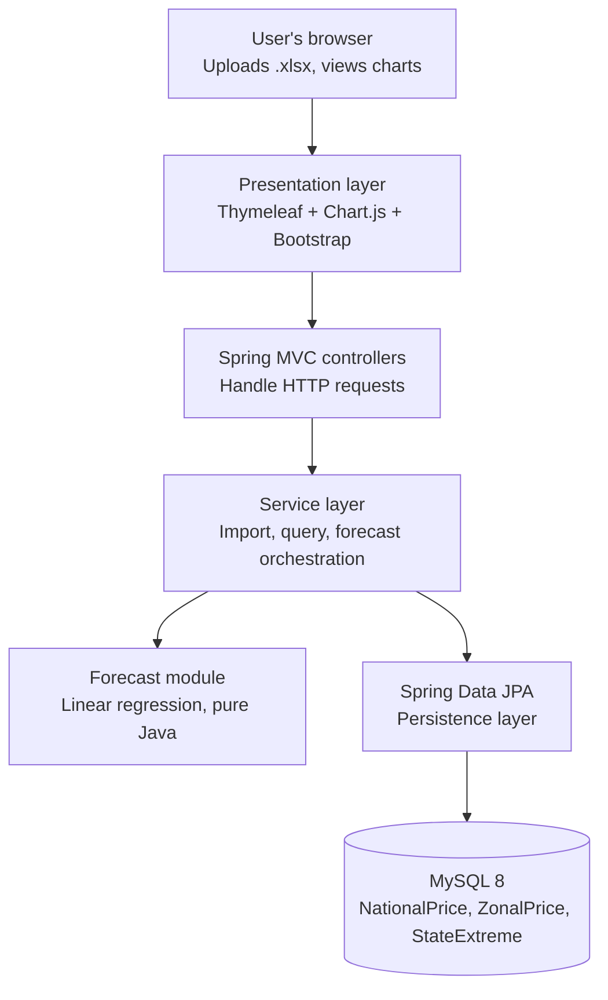

# StapleTrack NG

A Java + Spring Boot dashboard that turns Nigeria's monthly food price data into readable trends, regional comparisons, and forecasts — so families, small traders, and journalists can see how staple prices are moving and where they're headed.

Built as an MMS3 project for NIIT.

---

## The problem

Food inflation is one of the most pressing issues Nigerian families face right now. The National Bureau of Statistics (NBS) publishes monthly food price data — but it lives in Excel files most people never open, and each release only shows three data points at a time (this month, last month, same month last year). StapleTrack NG stitches these monthly releases together into an explorable dashboard with trends, regional comparisons, and short-term forecasts.

## Features (MVP)

1. **File import** — upload multiple monthly NBS "Selected Food Prices Watch" Excel files; overlapping months are deduplicated automatically.
2. **National trend dashboard** — line chart per staple showing national average price over time.
3. **Extremes explorer** — pick an item and month, see which state had the cheapest and most expensive price.
4. **Zonal disparity view** — bar chart per item across the 6 geopolitical zones (North Central, North East, North West, South East, South South, South West).
5. **Forecast** — predict the next 1–3 months of national average per staple using linear regression (pure Java, no ML library).

## Architecture



## Data model

Three tables, each keyed by item and month:

| Table          | Columns                                              | Uniqueness                        |
|----------------|------------------------------------------------------|-----------------------------------|
| `NationalPrice`| id, item, month_year, price                          | (item, month_year)                |
| `ZonalPrice`   | id, item, month_year, zone, price                    | (item, month_year, zone)          |
| `StateExtreme` | id, item, month_year, kind, state, price             | (item, month_year, kind)          |

`kind` is an enum: `HIGHEST` or `LOWEST`. `month_year` is stored as `java.time.YearMonth` via a JPA converter.

## Tech stack

| Layer       | Choice                                            |
|-------------|---------------------------------------------------|
| Language    | Java 21                                           |
| Framework   | Spring Boot 3.x (Web, Data JPA, Validation)       |
| Templating  | Thymeleaf                                         |
| Frontend    | Chart.js + Bootstrap (both via CDN, no build)     |
| Database    | MySQL 8                                           |
| Excel       | Apache POI (parses `.xlsx` directly)              |
| Analytics   | Pure Java linear regression (no ML library)       |
| Build       | Maven                                             |

## Getting started

### Prerequisites

- JDK 21 or later
- MySQL 8 or later (native install, or via Docker: `docker run --name stapletrack-db -e MYSQL_ROOT_PASSWORD=your_password -p 3306:3306 -d mysql:8`)
- Maven (or use the included `./mvnw` wrapper)

### Setup

1. Clone the repo:
   ```bash
   git clone https://github.com/ossolola/stapletrack-ng.git
   cd stapletrack-ng
   ```

2. Create the database:
   ```sql
   CREATE DATABASE stapletrack;
   ```

3. Set your MySQL password. All non-secret settings are already in `src/main/resources/application.properties`; the password goes in a git-ignored local file created from the checked-in template:
   ```bash
   cp src/main/resources/application-local.properties.example src/main/resources/application-local.properties
   ```
   Then edit `application-local.properties` and replace `change_me` with your MySQL root password. The `local` profile is active by default, so Spring picks it up automatically. Tables are created on startup from `src/main/resources/schema.sql`.

4. Run it:
   ```bash
   ./mvnw spring-boot:run
   ```

5. Open `http://localhost:8080` in your browser.

### Loading data

Download the monthly **Selected Food Prices Watch** releases from [nigerianstat.gov.ng](https://nigerianstat.gov.ng) — one Excel file per month. Upload each through the `/upload` page. Overlapping months across files are deduplicated on the `(item, month_year)` key. The more monthly files you upload, the richer the trend charts and the more reliable the forecast.

## Project structure

```
stapletrack-ng/
├── src/main/java/com/stapletrack/ng/
│   ├── StapleTrackApplication.java
│   ├── controller/       # DashboardController, UploadController, CompareController, ForecastController
│   ├── service/          # ImportService, PriceQueryService, ZonalService, ExtremesService
│   │   └── forecast/     # LinearRegression + ForecastService
│   ├── repository/       # NationalPriceRepository, ZonalPriceRepository, StateExtremeRepository
│   ├── entity/           # NationalPrice, ZonalPrice, StateExtreme + Kind enum
│   ├── parser/           # Apache POI parser for the NBS xlsx structure
│   └── dto/              # View models and chart payloads
├── src/main/resources/
│   ├── templates/        # Thymeleaf HTML templates
│   ├── static/           # CSS, JS assets (if any)
│   └── application.properties
└── pom.xml
```

## Data source

**National Bureau of Statistics (NBS) — Selected Food Prices Watch**

- Website: [nigerianstat.gov.ng](https://nigerianstat.gov.ng) → Reports
- Frequency: Monthly release
- Coverage per file: ~43 food items × (national averages for 3 months + zonal averages + highest/lowest state)
- Format: `.xlsx` (parsed directly by Apache POI)
- Historical depth: each file adds ~1–2 new months to your database, so 6–12 monthly files gives you a solid time series.

## Roadmap

- [x] Project scaffold and MySQL setup
- [ ] Three JPA entities + repositories (`NationalPrice`, `ZonalPrice`, `StateExtreme`)
- [ ] Apache POI parser for the NBS xlsx (both sheets)
- [ ] Upload endpoint + dedupe on unique keys
- [ ] National trend dashboard (line chart)
- [ ] Extremes explorer (cheapest/priciest state per item per month)
- [ ] Zonal disparity view (bar chart across 6 zones)
- [ ] Forecast module (linear regression on national averages)
- [ ] Deployment (Railway, Render, or a VPS)

## Author

Built for MMS3 (NIIT) submission.

## License

MIT
