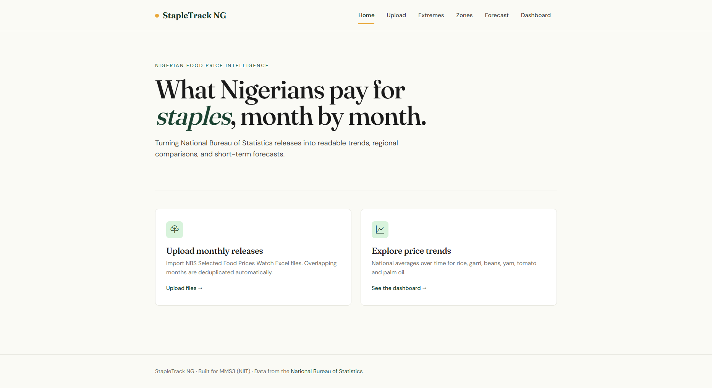
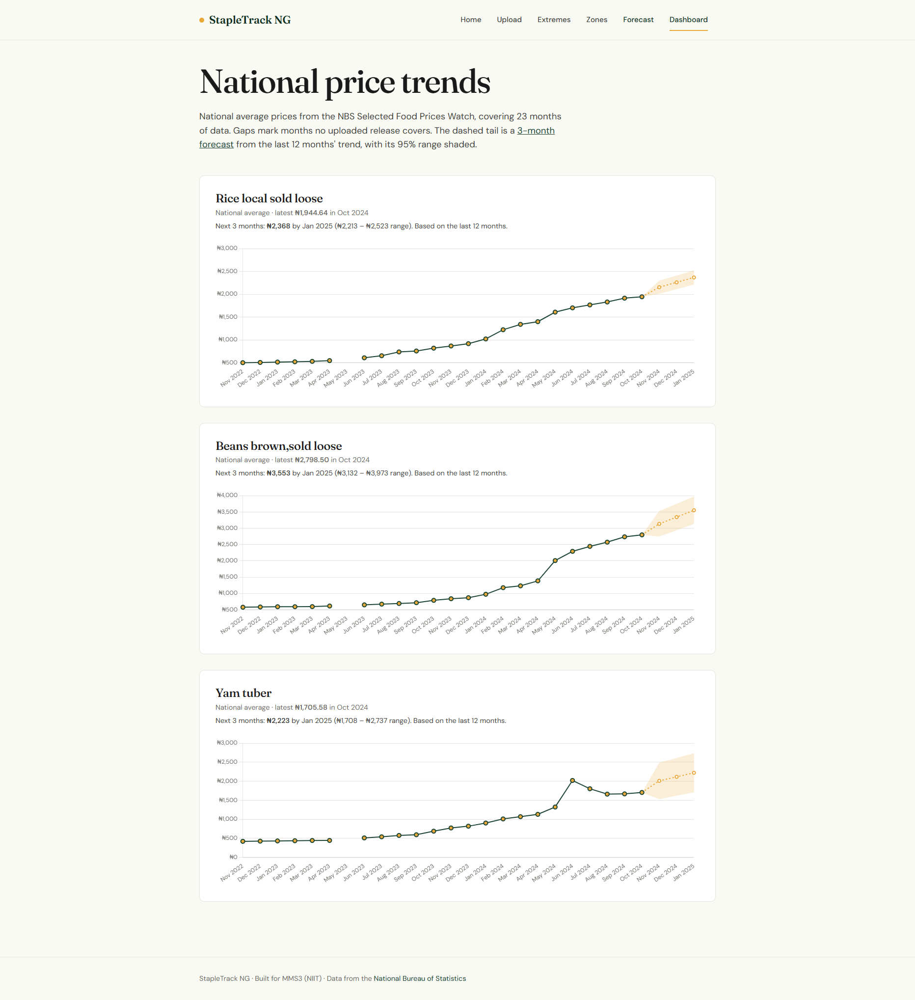
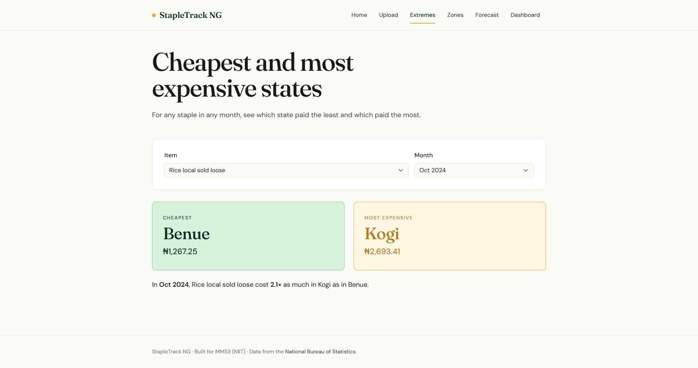
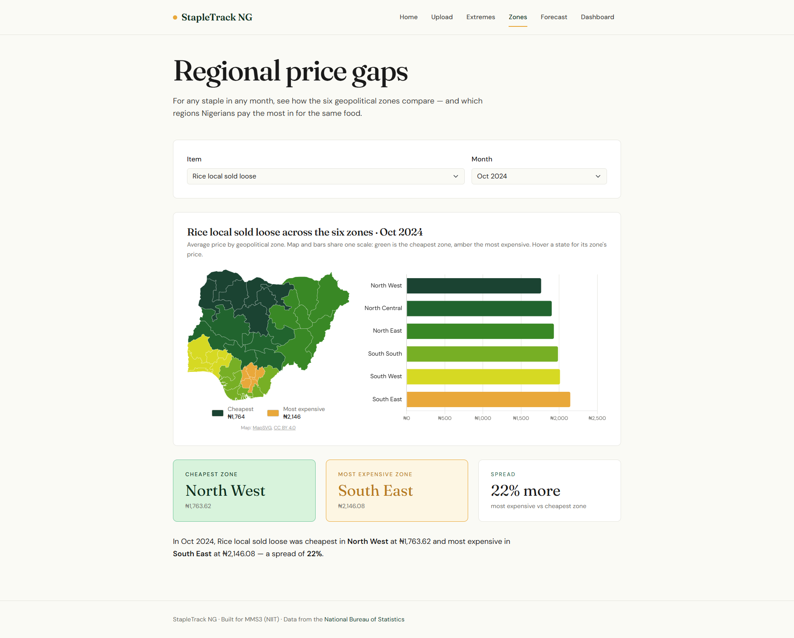
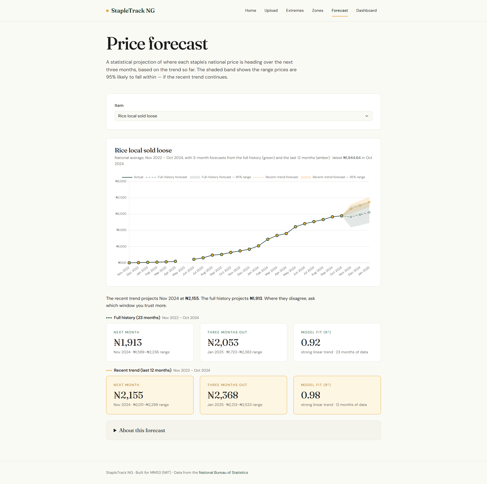
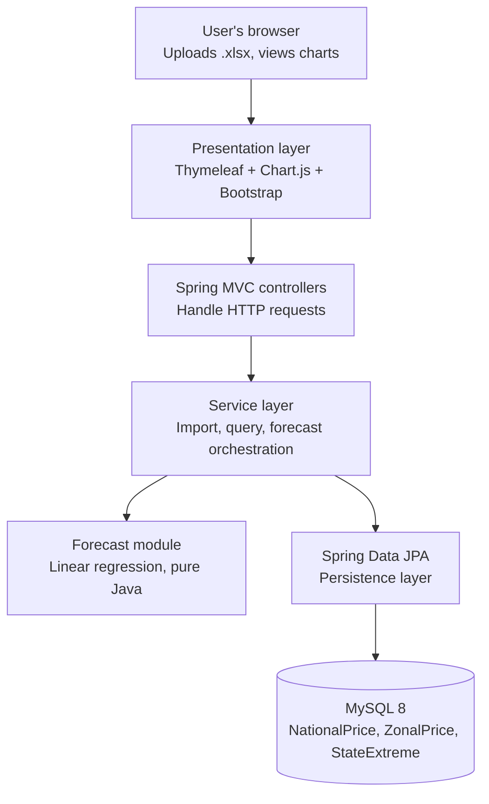

# StapleTrack NG

> **Tech:** Java 21 · Spring Boot 3 · Thymeleaf · MySQL · Chart.js · Apache POI · Pure-Java linear regression
>
> **Data:** 11 monthly NBS Selected Food Prices Watch releases (Nov 2023 – Oct 2024, excluding May 2024), reconstructed into 23 months of national price history (Nov 2022 – Oct 2024; May 2023 is the only gap) for 43 food items.
>
> **Submission tag:** `v1.0-mms3-submission`

A Java + Spring Boot dashboard that turns Nigeria's monthly food price data into readable trends, regional comparisons, and forecasts — so families, small traders, and journalists can see how staple prices are moving and where they're headed.

Built as an MMS3 project for NIIT.

---

## The problem

Food inflation is one of the most pressing issues Nigerian families face right now. The National Bureau of Statistics (NBS) publishes monthly food price data — but it lives in Excel files most people never open, and each release only shows three data points at a time (this month, last month, same month last year). StapleTrack NG stitches these monthly releases together into an explorable dashboard with trends, regional comparisons, and short-term forecasts.

## Features (MVP)

### 1. File import

Upload the monthly NBS "Selected Food Prices Watch" Excel files exactly as published. The parser finds sheets and columns by their content rather than their position (NBS changes tab order and header wording between releases), and overlapping months are updated rather than duplicated. The landing page leads to upload or to the charts.



### 2. National trend dashboard

Line charts of the national average price for rice, beans and yam across every uploaded month, with a dashed three-month forecast tail and its 95% range. Months no release covers are shown as gaps, not filled in.



### 3. Extremes explorer

Pick an item and month to see which state paid the least and which paid the most, and how far apart they were.



### 4. Zonal disparity view

A Nigeria states map beside a bar chart of the six geopolitical zones, both on the same green-to-amber scale from cheapest to most expensive zone.



### 5. Forecast

Three-month projections of the national average from pure-Java linear regression, shown for two windows side by side — the full history and the last 12 months — each with a 95% prediction band, R² and plain-English caveats.



## Architecture



## Data model

Three tables, each keyed by item and month:

| Table          | Columns                                              | Uniqueness                        |
|----------------|------------------------------------------------------|-----------------------------------|
| `NationalPrice`| id, item, month_year, price                          | (item, month_year)                |
| `ZonalPrice`   | id, item, month_year, zone, price                    | (item, month_year, zone)          |
| `StateExtreme` | id, item, month_year, kind, state, price             | (item, month_year, kind)          |

`kind` is an enum: `HIGHEST` or `LOWEST`. `month_year` is stored as `java.time.YearMonth` via a JPA converter.

## Tech stack

| Layer       | Choice                                            |
|-------------|---------------------------------------------------|
| Language    | Java 21                                           |
| Framework   | Spring Boot 3.x (Web, Data JPA, Validation)       |
| Templating  | Thymeleaf                                         |
| Frontend    | Chart.js + Bootstrap (both via CDN, no build)     |
| Database    | MySQL 8                                           |
| Excel       | Apache POI (parses `.xlsx` directly)              |
| Analytics   | Pure Java linear regression (no ML library)       |
| Build       | Maven                                             |

## Getting started

### Prerequisites

- JDK 21 or later
- MySQL 8 or later (native install, or via Docker: `docker run --name stapletrack-db -e MYSQL_ROOT_PASSWORD=your_password -p 3306:3306 -d mysql:8`)
- Maven (or use the included `./mvnw` wrapper)

### Setup

1. Clone the repo:
   ```bash
   git clone https://github.com/ossolola/stapletrack-ng.git
   cd stapletrack-ng
   ```

2. Create the database (optional — the connection URL uses `createDatabaseIfNotExist=true`, so the app creates it on first start):
   ```sql
   CREATE DATABASE stapletrack;
   ```

3. Set your MySQL password. All non-secret settings are already in `src/main/resources/application.properties`; the password goes in a git-ignored local file created from the checked-in template:
   ```bash
   cp src/main/resources/application-local.properties.example src/main/resources/application-local.properties
   ```
   Then edit `application-local.properties` and replace `change_me` with your MySQL root password. The `local` profile is active by default, so Spring picks it up automatically. Tables are created on startup from `src/main/resources/schema.sql`.

4. Run it:
   ```bash
   ./mvnw spring-boot:run
   ```

5. Open `http://localhost:8080` in your browser.

### Loading data

This app was built and defended using 11 monthly NBS releases (Nov 2023 – Oct 2024, excluding May 2024), giving 23 months of national price history from Nov 2022 to Oct 2024 (May 2023 is the only missing month). Each release carries three months — the current month, the previous month, and the same month a year earlier. The previous month is already in the prior release, so each file adds about 2 new months (the current month and the year-ago month). The number of files you load therefore sets the depth of the trends and the quality of the forecast.

Download the monthly **Selected Food Prices Watch** releases from [nigerianstat.gov.ng](https://nigerianstat.gov.ng) and upload each through the `/upload` page.

## Project structure

```
stapletrack-ng/
├── src/main/java/ng/stapletrack/
│   ├── StapleTrackNgApplication.java
│   ├── controller/       # Home, Upload, Dashboard, Extremes, Zones, Forecast pages + JSON API controllers
│   ├── service/          # ImportService, PriceQueryService, ExtremesService, ZonesService,
│   │   │                 #   NigeriaMapRenderer, Spread, StateNames, Zones
│   │   └── forecast/     # LinearRegression, ForecastService, ForecastResult, ForecastChart
│   ├── repository/       # NationalPriceRepository, ZonalPriceRepository, StateExtremeRepository
│   ├── entity/           # NationalPrice, ZonalPrice, StateExtreme, Zone, ExtremeKind, YearMonthConverter
│   └── parser/           # NbsPriceWatchParser — Apache POI parser for the NBS xlsx structure
├── src/main/resources/
│   ├── templates/        # Thymeleaf HTML templates (+ fragments/layout.html)
│   ├── static/           # css/app.css, js/forecast-chart.js, img/nigeria-zones.svg
│   ├── schema.sql
│   └── application.properties
├── docs/                 # screenshots/
└── pom.xml
```

## Data source

**National Bureau of Statistics (NBS) — Selected Food Prices Watch**

- Website: [nigerianstat.gov.ng](https://nigerianstat.gov.ng) → Reports
- Frequency: Monthly release
- Coverage per file: ~43 food items × (national averages for 3 months + zonal averages + highest/lowest state)
- Format: `.xlsx` (parsed directly by Apache POI)
- Historical depth: each file adds about 2 new months of national prices (and 1 month of zonal and state data), so 6–12 monthly files give a solid time series.

## Roadmap

- [x] Project scaffold and MySQL setup
- [x] Three JPA entities + repositories (`NationalPrice`, `ZonalPrice`, `StateExtreme`)
- [x] Apache POI parser for the NBS xlsx (both sheets)
- [x] Upload endpoint + dedupe on unique keys
- [x] National trend dashboard (line chart)
- [x] Extremes explorer (cheapest/priciest state per item per month)
- [x] Zonal disparity view (bar chart across 6 zones)
- [x] Forecast module (linear regression on national averages)
- [ ] Deployment (Railway, Render, or a VPS)

## Author

Built for MMS3 (NIIT) submission.

## License

MIT

## Credits

- **Price data**: [National Bureau of Statistics of Nigeria](https://nigerianstat.gov.ng), Selected Food Prices Watch monthly releases.
- **Nigeria states SVG map**: derived from [MapSVG](https://mapsvg.com/maps/nigeria) via [@svg-maps/nigeria](https://www.npmjs.com/package/@svg-maps/nigeria), licensed CC BY 4.0. Modified to add per-state zone tagging.
- **Typography**: [Fraunces](https://fonts.google.com/specimen/Fraunces) and [DM Sans](https://fonts.google.com/specimen/DM+Sans), both SIL Open Font License, served from Google Fonts.

## Troubleshooting

If tests fail with `NoClassDefFoundError` or other class-loading errors, run `.\mvnw clean test` (or `./mvnw clean test` on macOS/Linux) — VS Code's Java extension sometimes leaves stale compiled classes in `target/`.
